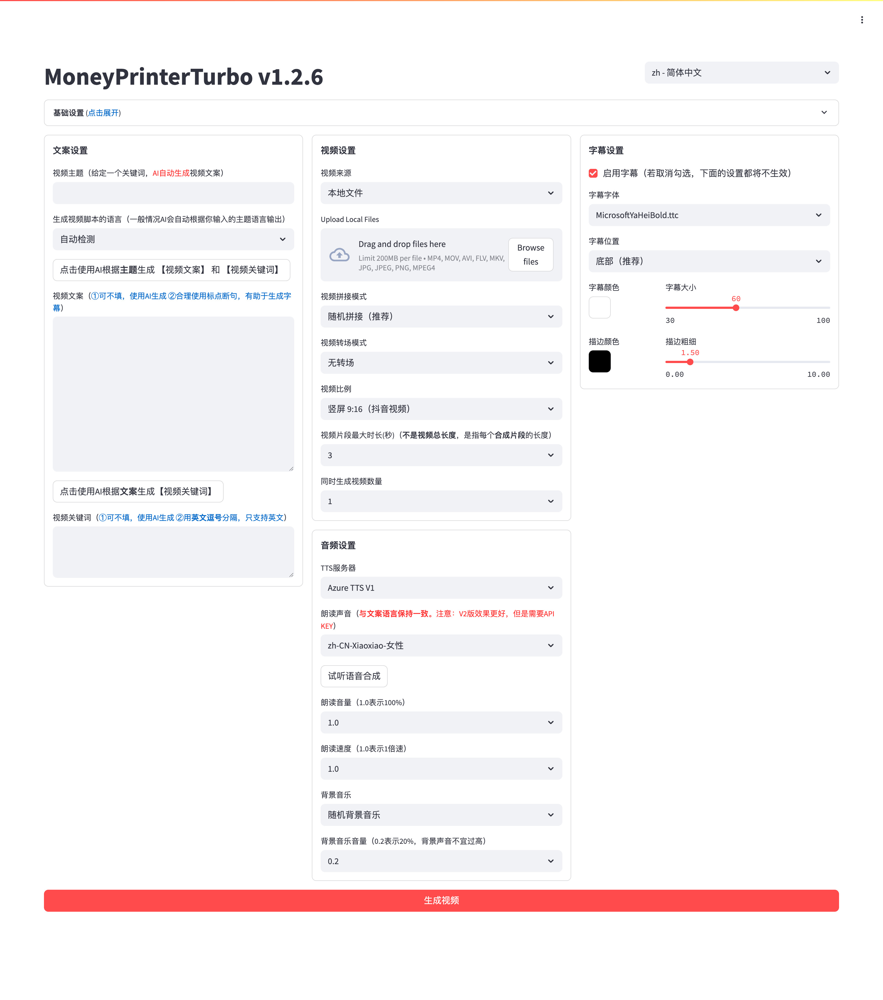
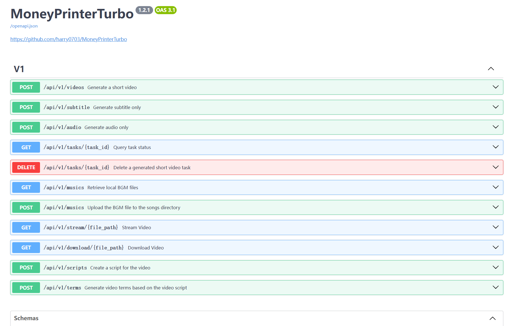

# MoneyPrinterTurbo

<h3>한국어 | <a href="README-en.md">English</a></h3>

MoneyPrinterTurbo는 영상 <b>주제</b> 또는 <b>키워드</b>만 입력하면 영상 대본, 영상 소재, 자막, 배경 음악을 자동으로 준비하고 고화질 쇼트폼 영상을 합성하는 도구입니다.

<h4>Web UI</h4>


<h4>API UI</h4>


## 주요 기능

- [x] 명확한 MVC 구조로 API와 Web UI를 함께 지원
- [x] AI 영상 대본 자동 생성 및 사용자 지정 대본 지원
- [x] 세로 9:16 `1080x1920`, 가로 16:9 `1920x1080` 영상 지원
- [x] 여러 영상을 한 번에 생성하는 배치 생성 지원
- [x] 영상 클립 길이 설정으로 소재 전환 빈도 조절 가능
- [x] 한국어, 영어 등 여러 언어의 대본 생성 지원
- [x] 다양한 TTS 음성 합성과 실시간 미리 듣기 지원
- [x] 자막 생성, 글꼴, 위치, 색상, 크기, 외곽선 설정 지원
- [x] 무작위 또는 지정 배경 음악과 배경 음악 볼륨 설정 지원
- [x] Pexels, Pixabay, 로컬 파일 기반의 영상 소재 사용
- [x] OpenAI, Moonshot, Azure, Qwen, Gemini, Ollama, DeepSeek, MiniMax, ERNIE, Pollinations, ModelScope 등 다양한 LLM 제공업체 지원

## 영상 예시

### 세로 9:16

| 예시 1 | 예시 2 | 예시 3 |
| --- | --- | --- |
| 생활을 더 즐겁게 만드는 방법 | 돈의 역할 | 삶의 의미는 무엇인가 |
| <video src="https://github.com/harry0703/MoneyPrinterTurbo/assets/11474162/624318d1-434f-4c22-a31b-0104f3f58c0c"></video> | <video src="https://github.com/harry0703/MoneyPrinterTurbo/assets/11474162/31959bda-4da4-4bb5-b361-b7d5b41547df"></video> | <video src="https://github.com/harry0703/MoneyPrinterTurbo/assets/11474162/185a3cfb-a126-41ce-b9c2-ae9f4c8bb3c9"></video> |

### 가로 16:9

| 예시 1 | 예시 2 |
| --- | --- |
| 삶의 의미는 무엇인가 | 왜 운동해야 하는가 |
| <video src="https://github.com/harry0703/MoneyPrinterTurbo/assets/11474162/908727eb-2b8b-4367-9c2c-fcc72f4a0fae"></video> | <video src="https://github.com/harry0703/MoneyPrinterTurbo/assets/11474162/e427a1cc-f2d4-4c9c-a991-6098a07b0c6f"></video> |

## 요구 사항

- 권장 시스템: Windows 10 이상, macOS 11.0 이상, 또는 주요 Linux 배포판
- GPU는 필수는 아니지만 로컬 전사, 빠른 영상 처리, 대량 생성에는 독립 GPU를 권장합니다.

| 항목 | 최소 사양 | 권장 사양 | 이상적인 사양 |
| --- | --- | --- | --- |
| CPU | 4코어 | 6-8코어 | 8코어 이상 |
| RAM | 4GB | 8GB | 16GB 이상 |
| GPU | 선택 사항 | 4GB VRAM | 8GB VRAM 이상 |
| Python | 3.11 | 3.11 | 3.11 |

## 설치 및 실행

### uv 사용

```bash
uv sync
uv run streamlit run webui/Main.py
```

### pip 사용

```bash
python -m venv .venv
source .venv/bin/activate
pip install -r requirements.txt
streamlit run webui/Main.py
```

Windows에서는 `webui.bat`, macOS/Linux에서는 `webui.sh`를 실행해도 됩니다.

## 설정

처음 실행하면 `config.example.toml`을 바탕으로 `config.toml`이 생성됩니다. API Key, LLM 제공업체, TTS 제공업체, 영상 소재 API Key 등을 자신의 환경에 맞게 설정하세요.

민감한 API Key가 들어가는 `config.toml`은 `.gitignore`에 포함되어 있으므로 공개 저장소에 올리지 마세요.

## Docker

```bash
docker compose up -d
```

GPU 기반 Whisper 자막 생성을 사용하려면 `docs/GPU_DOCKER_DEPLOYMENT.md`를 참고하세요.

## 라이선스

이 프로젝트는 MIT 라이선스를 따릅니다.
